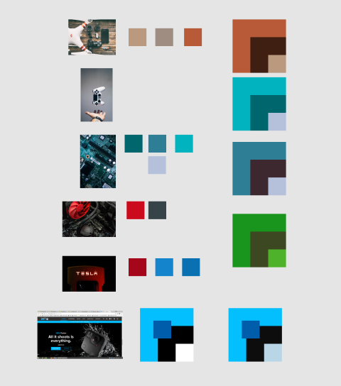
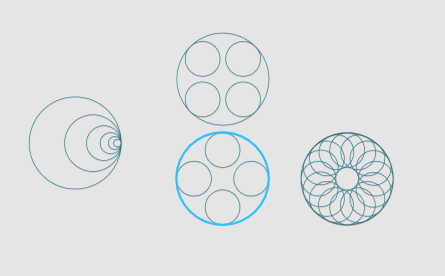
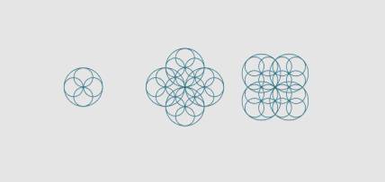
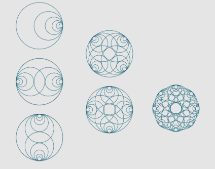
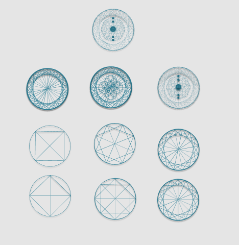
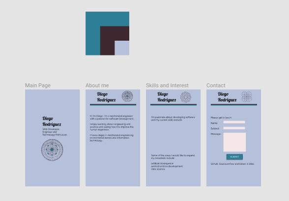
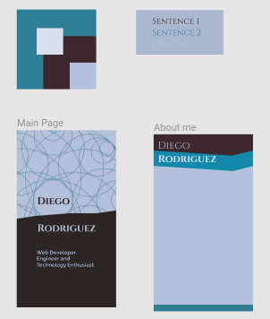

[Back to README.md](../README.md)

---

# Wireframes.

The wireframes started with a selection of different images from the moodboard and the analysis of the colors that were involved on them. 

The next step was to try to develop a logo for the website. Despite the fact I did not use the logo in the website at this stage this process was really interesting and enjoyable, and I will try to include this logos in future versions of the website. 

At the end I developed two designs for the website. The first one it was an atempt ot develop a clean look with tones of light blue but at the end I decided it looked to simple. 

The second design, wich was the main design I based the website on, featured darker colors and the idea was to develop a website with strong contrast ratios but also featuring a range of blue colors. 

